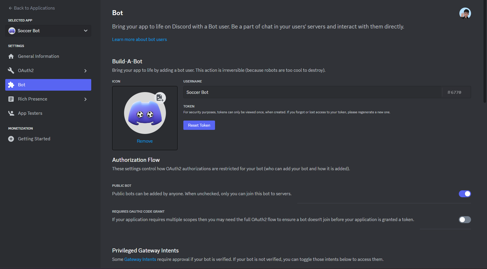
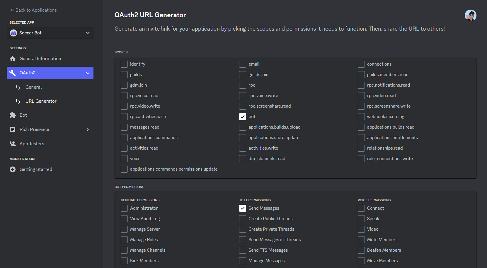
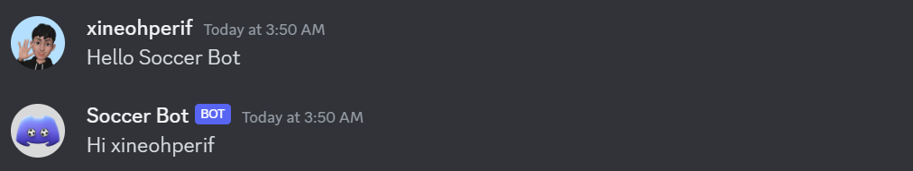

# Introduction

During the tough days of Covid, stuck with online studies and feeling down, Discord and my friends ✨ were a lifeline. Chatting and playing games on Discord made things a lot more fun.

I stumbled upon Discord bots, especially the Game Discord Bots, and thought it'd be cool to play soccer games. But, there weren't any. After some Google searching, I discovered I could make my own Discord Bot using Python.

With just one year of Python experience, I learned to code and set it up on repl.it. I kept adding our favorite games like "Guess the player," "Missing 11," and "Soccer Quiz."

This project is my favorite. It brought me joy and helped my friends and me get through one of the toughest times for everyone.

# Process

Let's walk through the process of creating the bot:

## 1. Register the bot

Start by visiting the [Discord Developer Portal](https://discord.com/developers/applications), selecting "New Application," and filling in the necessary information for your Discord bot. Create a new Bot Token, a crucial element for bot development.



**Note:** If you've already created the token, opt for "Reset Token" to generate a new one.

## 2. Invite the bot to your server

Now, invite the bot to your server for testing. Navigate to `OAuth2 -> URL Generator`, choose the options `bot` and `Administrator` for your local server, and generate a URL like `https://discord.com/api/oauth2/authorize?client_id=1174877410303426700&permissions=2048&scope=bot.` Paste this URL into your browser's search bar to add the bot to your server.



Once you see the bot's incoming message in your server, it confirms successful addition.

## 3. Start coding ✨

Now, to start, I would recommend trying to run your code on [repl.it](https://replit.com). Create an account if you haven't already, and create a new project.

Create 2 files `main.py` and `keep_alive.py`. These are the only 2 files you need right now.

For `keep_alive.py`, paste the following code in:

```python
from flask import Flask
from threading import Thread

app = Flask('')

@app.route('/')
def home():
    return "Hello. I am alive!"

def run():
  app.run(host='0.0.0.0',port=8080)

def keep_alive():
    t = Thread(target=run)
    t.start()
```

And for `main.py`, paste in the following template that I created:

```python
from discord.ext import commands
import os

client = commands.Bot(command_prefix='$')

@client.event
async def on_ready():
    print("Bot's ready")

@client.event
async def on_message(message):
    if message.author == client.user:
        return
    msg = message.content

    if msg == "Hello Discord Bot":
        await message.channel.send('Hi ' + message.author.display_name)

    await client.process_commands(message)

keep_alive()

client.run(os.environ["TOKEN"])
```

Now, please open the `Secrets` tab in your Repl and add a new secret. The key' will be "TOKEN", and the value will be the Bot token you copied from the previous step.

With that are set, you can start running your bot! Press `Run` and wait for a bit. After you see the message "Bot's ready" in terminal, you can start testing your bot.

In your server, try typing "Hello Discord Bot", it will respond like this:



## 4. Add your own touch

With all of that setup, you can now create anything you want! Just think of something you can do with the Discord Bot and make it yourself.

For reference, I will talk about the process of adding the Soccer Games. So in order to create the soccer games like starting 11 or guess the player, I need to get data from previous matches, or player's history.

But to do that, I need to find some kinds of API, or I have to crawl data from a soccer site. After looking around, I cannot find a free API that has things I need. So I decided to crawl data from [Transfermarkt](https://www.transfermarkt.com). This site has everything I need, from player's transfer history, to the line-ups of all the matches in history.

So firstly, I used `bs4` to crawl data. But a downside of `bs4` is that it only works on static web. And because transfrmarkt is a dynamic generated website, this library didn't work. Luckily, I found another alternative, which is `requests-html`. This works simillar to `bs4`, but it will wait for the website to load before crawling the data.

Below is a code demo of the functions for my games, which contains all the data crawling and game creating.

```python

from requests_html import HTMLSession
import random
import nextcord

#get_matches_from_team_and_year
def get_matches(team_id, year):
    url = f"https://www.transfermarkt.com/manchester-united/spielplandatum/verein/{team_id}/plus/0?saison_id={year}&wettbewerb_id=&day=&heim_gast=&punkte=&datum_von=-&datum_bis=-"
    session = HTMLSession()
    r = session.get(url)
    print(url)  
    matches = r.html.find('.ergebnis-link')
    matches_ids = [
        int(match.attrs["href"].split("/")[-1]) for match in matches
    ]
    return matches_ids

#get_match_info_from_match
def get_match_info(match_id):
    url = f"https://www.transfermarkt.com/spielbericht/index/spielbericht/{match_id}"
    session = HTMLSession()
    r = session.get(url)
    print(url)
    match_result = r.html.find('.sb-endstand', first=True).text.split("\n")[0]
    match_date = r.html.find('.sb-datum',first=True).find('a')
    for element in match_date:
      if 'href' in element.attrs:
        link = element.attrs["href"]
        if 'datum' in link.split("/")[-2]:
          match_date = link.split("/")[-1]
          break
    home_team_name = r.html.find('.sb-heim',
                                 first=True).find('a',
                                                  first=True).attrs["title"]
    away_team_name = r.html.find('.sb-gast',
                                 first=True).find('a',
                                                  first=True).attrs["title"]
    match_result = home_team_name + " " + match_result + " " + away_team_name
    two_teams_players = r.html.find('.aufstellung-spieler-container')
    two_teams_players = [
        player.text.split("\n")[1] for player in two_teams_players
    ]
    home_team_lu = two_teams_players[0:11]
    away_team_lu = two_teams_players[11:22]

    home_f= r.html.find('.aufstellung-unterueberschrift')[0].text.split()[2].split("-")
    home_f = [int(home_f[0]),sum(int(home_f[i]) for i in range(1,len(home_f)-1)),int(home_f[-1])]
    away_f= r.html.find('.aufstellung-unterueberschrift')[1].text.split()[2].split("-")
    away_f = [int(away_f[0]),sum(int(away_f[i]) for i in range(1,len(away_f)-1)),int(away_f[-1])]

    teams_fs = [home_f, away_f]
    teams_lu = [home_team_lu, away_team_lu]
    teams_names = [home_team_name, away_team_name]
    team_index = random.randint(0, 1)
    guess_team_name = teams_names[team_index]
    guess_team_lu = teams_lu[team_index]
    guess_team_f = teams_fs[team_index]

    guess_gk = [guess_team_lu[0]]
    guess_df = guess_team_lu[1:(1+guess_team_f[0])]
    guess_mf = guess_team_lu[(1+guess_team_f[0]):(1+guess_team_f[0]+guess_team_f[1])]
    guess_fw = guess_team_lu[(1+guess_team_f[0]+guess_team_f[1]):11]
    print(guess_gk, guess_df, guess_mf, guess_fw)
    question_string = f"Can you guess the players of {guess_team_name} in this Missing 11?"
    guess_f = '-'.join([str(i) for i in guess_team_f])
    return [question_string, match_result, match_date, guess_f, guess_team_lu, guess_gk,guess_df, guess_mf, guess_fw]


clubs = {
    "mu": 985,
    "ars": 11,
    "mci": 281,
    "liv": 31,
    "chel": 631,
    "tots": 148,
    "bayern": 27,
    "dort": 16,
    "barca": 131,
    "real": 418,
    "atm": 13,
    "lei": 1003,
    "westham": 379,
    "ac": 5,
    "inter": 46,
    "juve": 506,
    "psg": 583
}


def create_game():
    team_id = random.choice(list(clubs.values()))
    year = random.randint(2000, 2021)
    matches_ids = get_matches(team_id, year)
    match_id = random.choice(matches_ids)
    bruh = get_match_info(match_id)
    return bruh

def create_embed(title, result,date,formation,gk_done=[],df_done=[],mf_done=[],fw_done=[]):
  embed=nextcord.Embed(title=title, color=0x15003d)
  embed.add_field(name="Match Result", value=result, inline=False)
  embed.add_field(name="Match Date", value=date, inline=True)
  embed.add_field(name="Team Formation", value=formation, inline=True)
  if gk_done == []:
    gk_done = ["__"]
  if df_done == []:
    df_done = ["__"]
  if mf_done == []:
    mf_done = ["__"]
  if fw_done == []:
    fw_done = ["__"]
  embed.add_field(name="GK", value="\n".join(gk_done), inline=True)
  embed.add_field(name="DF", value="\n".join(df_done), inline=True)
  embed.add_field(name="MF", value="\n".join(mf_done), inline=True)
  embed.add_field(name="FW", value="\n".join(fw_done), inline=True)
  return embed

```

Hopefully, from this you can get some inspirations to create your own unique Discord bot.

# Conclusion

In conclusion, a Discord bot proves to be an excellent and practical way to enhance coding skills while creating something interesting for beginners.

I hope you find inspiration in this journey and that it proves useful for your own Discord bot endeavors.
